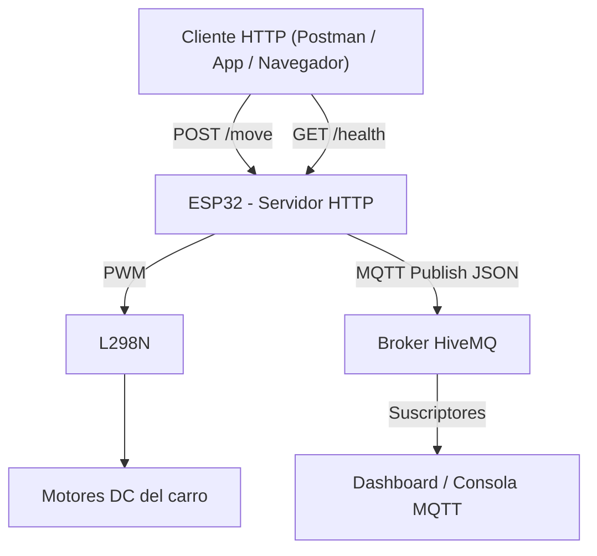
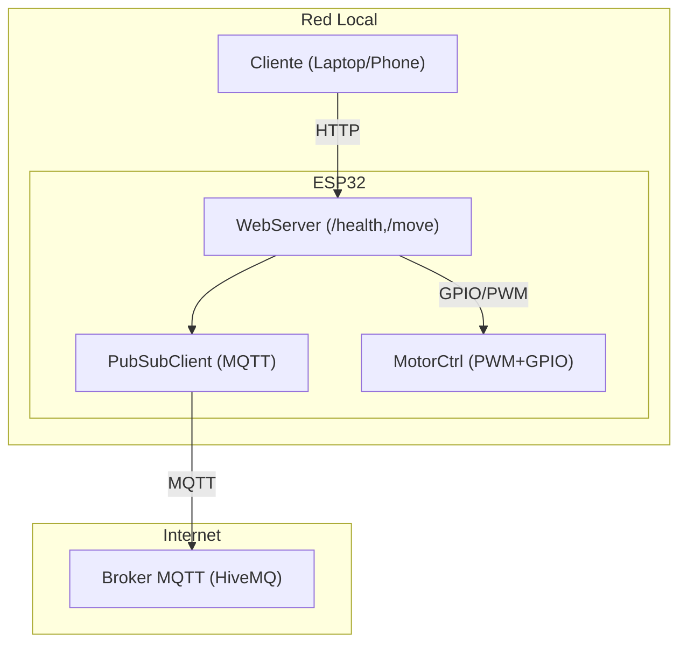
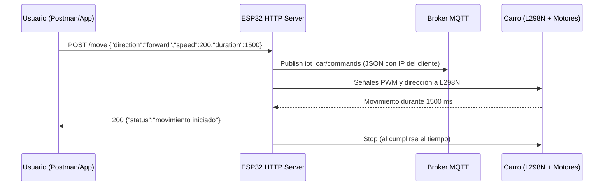

# WiFi-Cart — Control de Vehículo IoT con Servidor HTTP y Publicación MQTT

Proyecto para controlar un carro con **ESP32** usando **peticiones HTTP** y **publicación MQTT** de las órdenes recibidas. El sistema valida los parámetros (velocidad y duración) para evitar movimientos no deseados y expone un **endpoint de healthcheck**.

**Autores:** Axel Ariza Pulido, Juan Pablo Benitez Bernal y Juan Montes Sabogal  
**Materia:** Internet de las Cosas  
**Profesor:** Fabián Paeri (`fabianpaeri`)  
**Fecha de entrega:** 8 de octubre de 2025

---

## Objetivos

- Controlar el carro mediante peticiones HTTP.
- Exponer un único endpoint `/move` con parámetros de **dirección**, **velocidad** y **duración** (máx. 5000 ms).
- Exponer un endpoint `/health` para verificar disponibilidad del servidor.
- Conectar el ESP32 a un **broker MQTT** y **publicar** cada instrucción recibida incluyendo la **IP del cliente**.
- Documentar endpoints, arquitectura y pruebas; anexar diagramas e insumos en carpeta `docs/`.
- Cumplir estándares de diseño ingenieril: diagramas UML, criterios de diseño, riesgos/mitigaciones y evidencia de validación.

---

## Criterios de Diseño y Restricciones

- **Protocolos elegidos**
  - **HTTP** para control directo desde clientes comunes (Postman, navegador, apps), fácil depuración y semántica clara.
  - **MQTT** para desacoplar control de observabilidad, soportar múltiples suscriptores y baja latencia.
- **Restricciones y supuestos**
  - **Seguridad física:** duración máxima de movimiento `<= 5000 ms`; parada automática tras timeout.
  - **Recursos embebidos:** uso de parser JSON simple para bajo consumo de RAM; logs acotados por Serial.
  - **Red local variable:** reconexión a MQTT; publicación best-effort si el broker no está disponible.
- **Decisiones de hardware**
  - **L298N** por disponibilidad y compatibilidad de tensión/corriente con motores DC de prototipado.
  - **PWM** en ENA/ENB para modular velocidad; inversión de giro con IN1..IN4 e IN3..IN4.
- **Criterios de validación**
  - Respuestas HTTP coherentes (200, 400).
  - Mensaje MQTT publicado con `direction`, `speed`, `duration`, `client_ip`.
  - Latencia intra-LAN estable en el orden de decenas de ms.

---

## Arquitectura del Sistema


---

## UML de Despliegue 



---

## Hardware Utilizado

- ESP32-WROOM-32 (Wi-Fi integrado)
- Driver de motores L298N
- 2 motores DC (tracción)
- Fuente 7–12 V para motores
- Jumpers / protoboard

### Mapeo de Pines ESP32 ↔ L298N

| Pin ESP32 | Señal L298N | Función                                   |
|-----------|-------------|-------------------------------------------|
| 13        | ENA         | Velocidad Motor Derecho (PWM)             |
| 14        | IN1         | Dirección Motor Derecho                    |
| 27        | IN2         | Dirección Motor Derecho                    |
| 12        | ENB         | Velocidad Motor Izquierdo (PWM)           |
| 26        | IN3         | Dirección Motor Izquierdo                  |
| 25        | IN4         | Dirección Motor Izquierdo                  |

---

## Repositorio y Estructura

```
WiFi-Cart/
├─ sketch_oct6a/
│  ├─ sketch_oct6a.ino
│  └─ config.h
├─ .gitattributes
└─ README.md
```

---

## Configuración de Red y MQTT

En el sketch (`sketch_oct6a/sketch_oct6a.ino`) ajustar:

```cpp
// Wi-Fi (solo para demo; en producción mover a NVS/portal)
const char* ssid = "iPhone de Juan Pablo";
const char* password = "millos14";

// MQTT
const char* mqtt_server = "broker.hivemq.com";
const int   mqtt_port   = 1883;
const char* mqtt_topic  = "iot_car/commands";
```
---

## Endpoints HTTP

### 1) POST `/move`

Controla el movimiento del carro.

- **Content-Type:** `application/json`
- **Parámetros del body:**

| Campo       | Tipo   | Rango/Valores                         | Obligatorio |
|-------------|--------|----------------------------------------|-------------|
| `direction` | string | `forward`, `backward`, `left`, `right` | Sí          |
| `speed`     | int    | `1` a `255`                            | Sí          |
| `duration`  | int    | `1` a `5000` milisegundos              | Sí          |

**Ejemplo de solicitud:**
```http
POST http://<ESP32_IP>/move
Content-Type: application/json

{
  "direction": "forward",
  "speed": 200,
  "duration": 1500
}
```

**Respuesta exitosa (200):**
```json
{
  "status": "movimiento iniciado",
  "details": {
    "direction": "forward",
    "speed": 200,
    "duration": 1500,
    "client_ip": "172.20.10.3"
  }
}
```

**Respuestas de error:**
- 400 — {"error":"Cuerpo de la petición vacío"}
- 400 — {"error":"JSON inválido o campos faltantes ('direction', 'speed', 'duration')"}
- 400 — {"error":"Parámetros inválidos. 'speed' (1-255), 'duration' (1-5000ms)"}
- 400 — {"error":"Dirección no válida. Use 'forward', 'backward', 'right', 'left'"}

Validaciones implementadas:
- `speed` en rango 1..255.
- `duration` en rango 1..5000 ms.
- `direction` restringida a valores permitidos.

---

### 2) GET `/health`

Verifica que el servidor HTTP del ESP32 esté operativo.

**Ejemplo de respuesta (200):**
```json
{
  "status": "ok",
  "chip_id": "cc9d3f4a0"
}
```

---

## Publicación MQTT

- **Broker:** broker.hivemq.com  
- **Puerto:** 1883  
- **Topic:** iot_car/commands

Cada solicitud exitosa a `/move` genera un **mensaje JSON** publicado en el topic:

```json
{
  "direction": "left",
  "speed": 200,
  "duration": 1500,
  "client_ip": "172.20.10.5"
}
```

Suscriptores pueden visualizar en un cliente web MQTT (HiveMQ WebSocket Client) en tiempo real.

---

## Diagrama de Secuencia



---

## Validación y Resultados de Pruebas

### Casos de prueba
1. **Healthcheck OK**  
   GET `/health` → 200, `status=ok`.
2. **Movimiento válido**  
   POST `/move` con `forward,200,1500` → 200. MQTT recibe JSON con `client_ip`.
3. **Parámetros fuera de rango**  
   `speed=0` o `duration=6000` → 400 con mensaje de error.
4. **Dirección inválida**  
   `direction="up"` → 400.
5. **Intermitencia de red MQTT**  
   Broker no disponible → reintentos; publicación en cuanto reconecta.

---

## Seguridad y Confiabilidad

- **Límite de duración** `<= 5000 ms` para evitar movimientos indefinidos.
- **Stop automático** por `moveStopTime` y `stopMotors()`.
- **Reintento MQTT** en `reconnect_mqtt()`; `clientId` aleatorio para evitar colisiones.
- **Recomendado** (extensiones fáciles de integrar):
  - **Token** en header `X-API-Key` para `/move`.
  - **Rate limiting**: rechazar si hay movimiento en curso.
  - **MQTT QoS 1** y **LWT** para presencia del dispositivo.
  - **Watchdog** por cuelgues de red.

---

## Equipo y Roles

- **Axel Ariza Pulido:** Control de motores, montaje y pruebas físicas.  
- **Juan Pablo Benitez Bernal:** Servidor HTTP, validaciones y colección Postman.  
- **Juan Montes Sabogal:** Cliente MQTT, diagramas y documentación.

---

## Roadmap y Extensiones Propuestas

- Portal de credenciales (AP + captive portal) con guardado en NVS.  
- OTA para actualizar firmware sin cable.  
- Telemetría a `iot_car/telemetry` (voltaje batería, temperatura driver).  
- Panel web local con botones y feed MQTT.

---

## Colección Postman

Enlace público:  
https://api.postman.com/collections/29816653-4aaa258a-961d-45fe-846f-f1f14398d6e5?access_key=PMAT-01K6X07M2FWH008YX6HHY8E59P

Resumen de requests incluidos:

| Nombre    | Método | URL base             | Endpoint | Body (JSON)                                                             |
|-----------|--------|----------------------|----------|-------------------------------------------------------------------------|
| Forward   | POST   | `http://172.20.10.5` | `/move`  | `{"direction":"forward","speed":200,"duration":1500}`                   |
| Backward  | POST   | `http://172.20.10.5` | `/move`  | `{"direction":"backward","speed":200,"duration":1500}`                  |
| Left      | POST   | `http://172.20.10.5` | `/move`  | `{"direction":"left","speed":200,"duration":1500}`                      |
| Right     | POST   | `http://172.20.10.5` | `/move`  | `{"direction":"right","speed":200,"duration":1500}`                     |
| Health    | GET    | `http://172.20.10.5` | `/health`| —                                                                       |

> Reemplazar la IP base por la IP real del ESP32 mostrada en el Monitor Serial.

---

## Puntos clave del Sketch

- Servidor HTTP con `WebServer`.
- Cliente MQTT con `PubSubClient`.
- Control de motores con `analogWrite` sobre ENA/ENB y señales IN1–IN4.
- Validaciones de payload, cálculo de `moveStopTime` y parada automática.

---

---
## Telemetría de Ultrasonido (HC-SR04)
- **Tópico MQTT de telemetría**: `iot_car/ultrasonic` (configurable con `MQTT_TOPIC_TELEM`)
- **Período de publicación**: `1000 ms` por defecto (`ULTRASONIC_PERIOD_MS`).
- **Modo mock**: activado por defecto (`USE_ULTRASONIC_MOCK=1`). Para usar el sensor real, compila con `-D USE_ULTRASONIC_MOCK=0`.
**Payload JSON publicado:**
```json
{
  "distance_cm": 123.45,     // null si timeout / lectura inválida
  "ts": 412345,              // millis desde arranque
  "chip_id": "cc9d3f4a0",
  "ip": "172.20.10.5",
  "mock": true
}
```
---
## Configuración por Preprocesador (`config.h`)
Centraliza credenciales, pines y parámetros del proyecto. Puedes anularlos en tiempo de compilación con `-D`.
```cpp
// --------- WIFI ----------
#ifndef WIFI_SSID
#define WIFI_SSID "iPhone de Juan Pablo"
#endif
#ifndef WIFI_PASS
#define WIFI_PASS "millos14"
#endif
// --------- MQTT ----------
#ifndef MQTT_SERVER
#define MQTT_SERVER "broker.hivemq.com"
#endif
#ifndef MQTT_PORT
#define MQTT_PORT 1883
#endif
#ifndef MQTT_TOPIC_CMDS
#define MQTT_TOPIC_CMDS "iot_car/commands"
#endif
#ifndef MQTT_TOPIC_TELEM
#define MQTT_TOPIC_TELEM "iot_car/ultrasonic"
#endif
// --------- Pines Motores L298N ----------
#ifndef ENA_PIN
#define ENA_PIN 13   // PWM Motor Derecho
#endif
#ifndef ENB_PIN
#define ENB_PIN 12   // PWM Motor Izquierdo
#endif
#ifndef IN1_PIN
#define IN1_PIN 14
#endif
#ifndef IN2_PIN
#define IN2_PIN 27
#endif
#ifndef IN3_PIN
#define IN3_PIN 26
#endif
#ifndef IN4_PIN
#define IN4_PIN 25
#endif
// --------- HC-SR04 ----------
#ifndef TRIG_PIN
#define TRIG_PIN 35  // Trigger (OUTPUT)
#endif
#ifndef ECHO_PIN
#define ECHO_PIN 34  // Echo (INPUT) -> Debe bajar a 3.3V con divisor
#endif
// 1 = simulado, 0 = real
#ifndef USE_ULTRASONIC_MOCK
#define USE_ULTRASONIC_MOCK 1
#endif
#ifndef ULTRASONIC_PERIOD_MS
#define ULTRASONIC_PERIOD_MS 1000
#endif
#ifndef ULTRASONIC_TIMEOUT_US
#define ULTRASONIC_TIMEOUT_US 30000
#endif
```
---
## Función de Lectura y Publicación
En el `sketch_oct6a.ino` se añade la lectura (mock o real) y la publicación periódica.
```cpp
float readUltrasonicCm() {
#if USE_ULTRASONIC_MOCK
  float base = random(1000, 25100) / 100.0f; // 10.00 a 250.99 cm
  float jitter = random(-10, 10) / 100.0f;
  return max(0.0f, base + jitter);
#else
  pinMode(TRIG_PIN, OUTPUT);
  pinMode(ECHO_PIN, INPUT);
  digitalWrite(TRIG_PIN, LOW);
  delayMicroseconds(3);
  digitalWrite(TRIG_PIN, HIGH);
  delayMicroseconds(10);
  digitalWrite(TRIG_PIN, LOW);
  unsigned long duration = pulseIn(ECHO_PIN, HIGH, ULTRASONIC_TIMEOUT_US);
  if (duration == 0) return -1.0f; // timeout
  float distanceCm = duration / 58.0f; // us -> cm aproximado
  return distanceCm;
#endif
}
void publishUltrasonic() {
  float d = readUltrasonicCm();
  String payload = "{";
  payload += "\"distance_cm\":"; payload += (d < 0 ? "null" : String(d, 2));
  payload += ",\"ts\":" + String((unsigned long)millis());
  payload += ",\"chip_id\":\"" + String(ESP.getEfuseMac(), HEX) + "\"";
  payload += ",\"ip\":\"" + WiFi.localIP().toString() + "\"";
  payload += ",\"mock\":"; payload += (USE_ULTRASONIC_MOCK ? "true" : "false");
  payload += "}";
  publishMqtt(MQTT_TOPIC_TELEM, payload);
}
```
**Ejecución periódica en `loop()`**:
```cpp
static unsigned long nextTelemetryAt = 0;
unsigned long now = millis();
if ((long)(now - nextTelemetryAt) >= 0) {
  publishUltrasonic();
  nextTelemetryAt = now + ULTRASONIC_PERIOD_MS;
}
```
---
## Compilación con Overrides (opcional)
Puedes cambiar parámetros **sin editar** `config.h` usando defines en la compilación.
- **Arduino CLI**:
```bash
arduino-cli compile -b esp32:esp32:esp32   -D USE_ULTRASONIC_MOCK=0   -D TRIG_PIN=4 -D ECHO_PIN=5   -D MQTT_TOPIC_TELEM=\"iot_car/ultra_lab\"
```
- **PlatformIO (`platformio.ini`)**:
```ini
build_flags = 
  -DUSE_ULTRASONIC_MOCK=0 
  -DTRIG_PIN=4 -DECHO_PIN=5 
  -DMQTT_TOPIC_TELEM=\"iot_car/ultra_lab\"
```
---
## Precaución Eléctrica Importante
El pin **ECHO** del HC‑SR04 entrega ~**5 V** y el **ESP32** solo admite **3.3 V** en entradas. 
Usa un **divisor resistivo** (p. ej., 10 kΩ arriba y 20 kΩ abajo) para reducir el nivel antes de conectar a `ECHO_PIN`. 
Comparte **GND** entre el ESP32 y el sensor.
---
## Pruebas Rápidas
1. **Mock por defecto** → sin cambios, se publican lecturas cada 1s en `iot_car/ultrasonic`.
   ```bash
   mosquitto_sub -h broker.hivemq.com -t iot_car/ultrasonic -v
   ```
2. **Sensor físico** → compila con `-D USE_ULTRASONIC_MOCK=0` y **divisor** en ECHO.
3. **Movimiento + telemetría** → `/move` sigue publicando en `iot_car/commands` mientras la telemetría fluye en paralelo.


## Referencias

[1] OASIS, “MQTT Version 3.1.1,” 2014.

[2] Espressif Systems, “ESP32 Technical Reference Manual,” 2023–2025.

[3] OpenAI, ChatGPT.

[4] Tecnopura. “Sensor de ultrasonido distancia HC-SR04 para Arduino.” https://www.tecnopura.com/producto/sensor-de-ultrasonido-distancia-hc-sr04-para-arduino/

[5] Tecnopura. “Base/Soporte para módulo sensor HC-SR04.” https://www.tecnopura.com/producto/base-soporte-para-modulo-sensor-de-ultrasonido-hc-sr04/

[6] W3Schools. “C — Organize Code (Header Files).” https://www.w3schools.com/c/c_organize_code.php

[7] Arduino Project Hub (Isaac100). “Getting started with the HC-SR04 ultrasonic sensor.” https://projecthub.arduino.cc/Isaac100/getting-started-with-the-hc-sr04-ultrasonic-sensor-7cabe1
